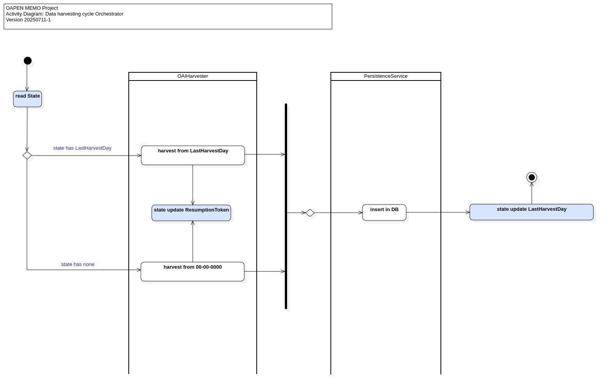
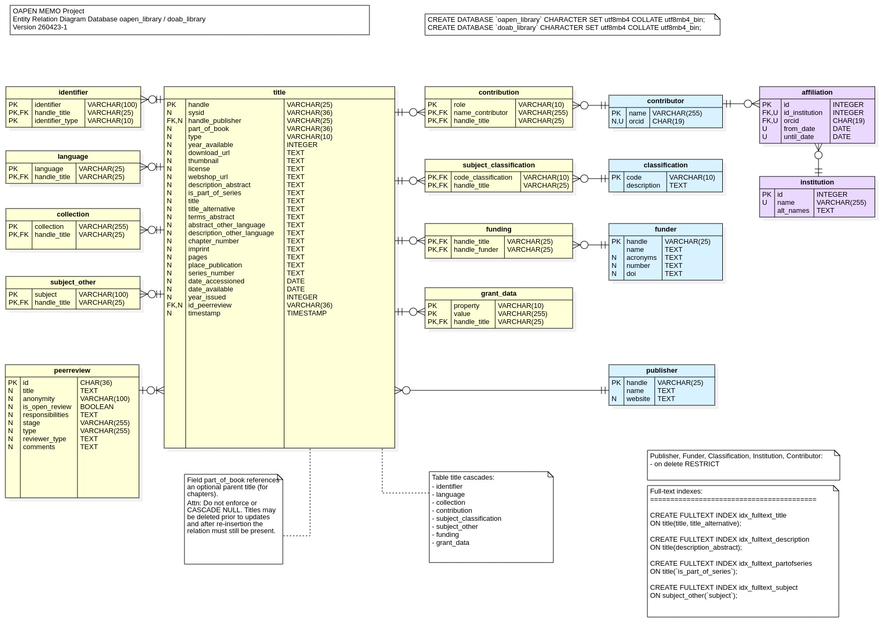

# OAPEN MEMO XOAI Harvester

## What is it?

A harvester service that populates a local OAPEN Library database with data from the OAPEN DSpace XOAI provider.

See `/dev/db` for the database create script.

## What does it do?
 
1. Read last harvest date;
2. harvest OAI since last harvest date;
3. parse records and save to database;
4. fetch corresponding export chunks and save to database;
5. Update last harvest date.

Configuration settings are read from `application.properties`.

Harvesting may use a negative amount of offset days from the current date, to ensure only redacted and matured data is harvested.  
Use `app.harvest.daysBack = 7` to set an offset period of 7 days.

## What to configure

Configuration settings are excluded from the jar artifact and must be provided externally. An example can be found at `/src/main/resources/application.properties.tpl`. For development copy this file to `src/main/resources/application.properties`.

For production put the harvester application jar executable and `application.properties` in the same directory.

These settings must be provided:

* `spring.datasource.url`   
   Points to the library database where harvested data is stored
* `spring.datasource.username`   
* `spring.datasource.password`   
* `app.harvest.daysBack`   
   Harvest until `daysBack` days before the current date. This settings takes into account that DSpace data
   may have changed, and therefore is included in OAI output, but still needs to be checked and possibly edited by an OAPEN employee. 
   Using a buffer time  prevents incomplete data to appear in the local library database.
* `app.domain`   
   Choose which parser to use. Currently there are 2 parsers: `oapen` and `doabooks`.
* `app.path.oaipath`   
   OAI provider URL 
* `app.path.app-status`   
   Path to a properties file where harvesting status is saved (e.g. `${user.home}/oapenmemo/harvester/harvester-state.properties`) 

## How to run it?

Run as an executable jar: 

	./harvester-x.y.z.jar

Add an integer argument to override the `app.harvest.daysBack` value as set in the properties file:

	./harvester-x.y.z.jar 5

Typically you want to run this as a cronjob (for the corresponding Linux user) once a day:

    0 1 * * * ~/harvester-x.y.z.jar >/dev/null 2>&1 

## Anything else?

- Application status (last harvest date etc.) is saved to a file as set in field `harvester-state.properties` in `application.properties`;

- Logs are saved to a file as set in field `logging.file.name` in `application.properties`;

---

## Orchestrator Activity Diagram

    
*Figure 3. Orchestrator Activity Diagram*

## Database 

A script to create the empty OAPEN Library database is included in directory [/dev/db/](./dev/db/). 

The view definition `vw_title_combined_fields.sql` in the same directory serves to abstract away some frequently used SQL joins, allowing for more compact query SQL where desired, but it can be ignored if there is no such wish.

### Full Text indexes

Table `title` and `subject_other` feature a number of FULL TEXT indexes on `text` or `varchar` fields:

    FULLTEXT KEY `idx_fulltext_title` (`title`,`title_alternative`)

These indexes allow for queries using full text searches: 

    SELECT 
    	   title.*, group_concat(subject) as subjects 
    FROM 
    	   title 
    	   RIGHT JOIN subject_other ON handle = handle_title
    WHERE 
    	   MATCH(title, title_alternative) 
    	   AGAINST('comic* OR cartoon*' in boolean mode)
    	OR	
    	   MATCH(description_abstract) 
    	   AGAINST('comic* OR cartoon*' in boolean mode)
    	OR
    	   MATCH(subject_other.subject) 
    	   AGAINST('comic* OR cartoon*' in boolean mode) 
    GROUP BY
    	   handle	
    ORDER BY 
    	   handle
    

### Database ERD

