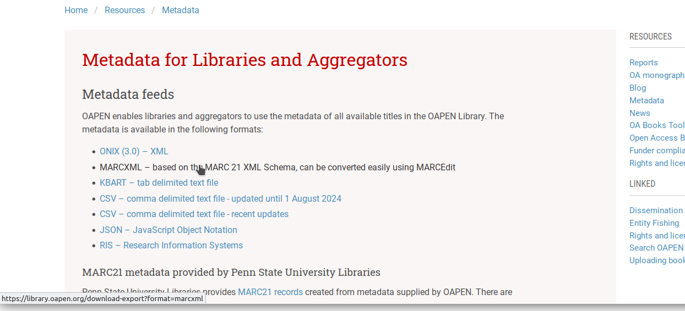

# OAPEN MEMO XOAI Harvester

## What is it?

A harvester service that populates a local OAPEN Library database with data from the OAPEN DSpace XOAI provider.

See `/dev/db` for the database create script.

## What does it do?
 
1. Read last harvest date;
2. harvest XOAI since last harvest date;
3. parse records and save to database;
4. fetch corresponding export chunks and save to database;
5. Update last harvest date.

Configuration settings are read from `application.properties`

Harvesting may use a negative amount of offset days from the current date, to ensure only redacted and matured data is harvested.  
Use `app.harvest.daysBack = 7` to set an offset period of 7 days.

## What to configure

Configuration settings must be provided at `/src/main/resources/application.properties` (or use context dependent settings like `application-prod`, `application-dev` etc.). 

Copy from `/src/main/resources/application.properties.tpl` and provide settings for:

* `spring.datasource.url`   
   Points to the library database where harvested data is stored
* `spring.datasource.username`   
* `spring.datasource.password`   
* `app.harvest.daysBack`   
   Harvest until `daysBack` days before the current date. This settings takes into account that DSpace data
   may have changed, and therefore is included in OAI output, but still needs to be checked and possibly edited by an OAPEN employee. 
   Using a buffer time  prevents incomplete data to appear in the local library database.
* `app.path.oaipath`   
   OAI provider URL 
* `app.path.app-status`   
   Path to a properties file where harvesting status is saved (suggested value: `${user.home}/oapenmemo/harvester-state.properties`) 
* `app.path.exportsdir`   
   Path to directory where single file exports are downloaded (suggested value: `${user.home}/oapenmemo/downloads`)
* `app.url.exports`   
   An array of downloadable files on the OAPEN DSpace server, containing the entire OAPEN collection in a number of formats. See below at 
   'Harvesting pre-processed exports' for an explanation about how this data is handled.   
    
   For setting `app.url.exports` to point to the 4 formats MARCXML, ONIX, RIS and KBart, it should read:

        {
          MARCXML:'https://library.oapen.org/download-export?format=marcxml',
          ONIX:'https://library.oapen.org/download-export?format=onix',
          RIS:'https://library.oapen.org/download-export?format=ris',
          KBART:'https://library.oapen.org/download-export?format=tsv'
        }
    
   *(Indentation and newlines inserted for readability)*    
    

## How to run it?

Run as an executable jar: 

	./harvester-x.y.z.jar

Add an integer argument to override the `app.harvest.daysBack` value as set in the properties file:

	./harvester-x.y.z.jar 5

Typically you want to run this as a cronjob (for the corresponding user) once a day:

    0 1 * * * ~/harvester-x.y.z.jar >/dev/null 2>&1 

## Anything else?

- Application status (last harvest date etc.) is saved to a directory `[user.home]/oapenmemo`;
- Downloaded export files are saved to a directory `[user.home]/oapenmemo/downloads`. These files are only downloaded once, after the initial harvest. After the initial harvest, export data chunks are requested separately from the DSpace API;
- logs are saved to a directory `[user.home]/oapenmemo/logs`

---

## Annex: Harvesting pre-processed exports from DSpace (ONIX, MARCXML, RIS, KBart)

DSpace provided exports in ONIX, MARCXML, RIS and KBart format are available both as a single download for the entire collection (Figure 1) and on a per-title base (Figure 2). This allows us to bypass the need to generate these formats ourselves (using SQL and scripts that would be perfectly possible, but complex).

To speed up things and to not put too much demand on the DSpace server, on initial database population the files containing the entire collection for each of the 4 formats are downloaded once and then chopped in pieces that contain a single title. The resulting chunks, containing ONIX, MARCXML, RIS and KBart descriptions for a title, are then inserted in the `export_chunk` table and linked to the corresponding `title` record.

From there, on daily OAI synchronization where only a limited number of `title` records are requested per time, the OAI records are inspected to get direct links to the corresponding single-title ONIX, MARCXML, RIS and KBart descriptions, which are then requested from the DSpace server and used to update or insert the `export_chunk` records for the corresponding titles.

    
*Figure 1. Links to single file downloads of the entire OAPEN library in specific formats, as available on the OAPEN website.*

    
*Figure 2. Links to record representations in specific formats are included in OAI records.*

